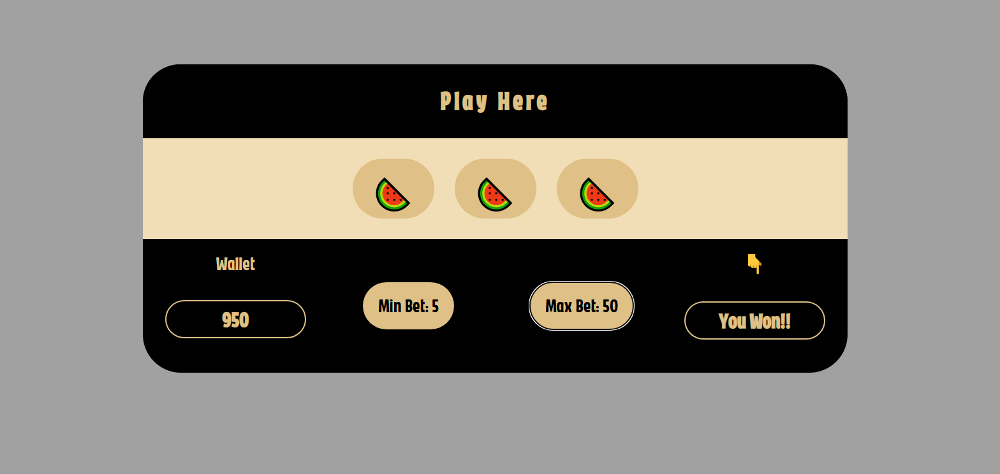

# 🎰 Slot Machine

A simple browser-based slot machine game built with vanilla JavaScript. 
Spin 3 reels, place bets, and watch your balance update in real time.

## 🔗 Live Demo
[Play it here](https://playfulslotmachine.netlify.app/)

## ✨ Features
- 3 spinning reels with 5+ unique symbols each
- Place a minimum or maximum bet
- Balance updates live based on wins/losses

## 🛠️ Built With
- HTML, CSS, JavaScript

## 🚀 Running Locally
1. Clone the repo
2. Open `index.html` in your browser

## 📚 What I Learned
- Working with randomization logic (reel symbol selection)
- Managing and updating game state without a framework
